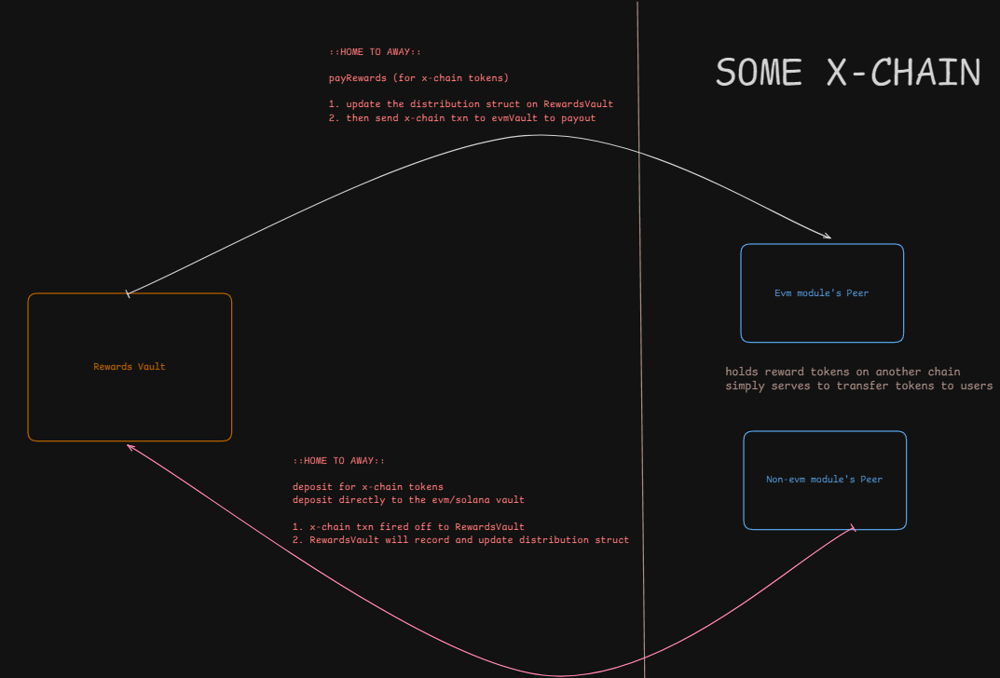

# Decimal Precision wrt to reward tokens: rebasing MOCA tokens, rewards, index and emission calculations

Handling varying decimal precision for reward tokens, and ensuring that the index and emission calculations are correct.

## 1. Decimal Precision for indexes and rewards

indexes are denominated in the distribution's precision
rewards calculated and stored in the distribution's precision

At the end of the day, we are paying out different rewards - so adhere to their respective precision.

However, when calculating rewards, in both `_updateUserAccount` and `_updateVaultAccount`, we must convert the decimal precision of `stakedBase` to the distribution's precision.
Since `stakedBase` is denominated in `1E18`, we must convert it to the distribution's precision.

If the distribution's precision is lower than `1E18`, we are rounding down `stakedBase`, and therefore calculated rewards will be lower than they should be.
If the distribution's precision is higher than `1E18`, we are simply adding zeros to `stakedBase`; this does not impact the rewards calculation. **[TODO: check if this is correct]**

```solidity
    uint256 balanceRebased = (user.stakedTokens * distribution.TOKEN_PRECISION) / 1E18;
    uint256 accruedRewards = _calculateRewards(balanceRebased, newUserIndex, userAccount.index, distribution.TOKEN_PRECISION);
                
    // for calc. rewards from index deltas. assumes tt indexes are expressed in the distribution's precision. therefore balance must be rebased to the same precision
    function _calculateRewards(uint256 balanceRebased, uint256 currentIndex, uint256 priorIndex, uint256 PRECISION) internal pure returns (uint256) {
        return (balanceRebased * (currentIndex - priorIndex)) / PRECISION;
    }

```

### 1.1 If the distribution's precision is lower than `1E18`

- Moca Tokens: 1E18 precision
- Reward Tokens: 1E6 precision

When going from 18 dp to 6 dp, we lose 12 dp of precision.

**Example: 1.2345678 MOCA staked**
 
- 1.23456 MOCA rebased to 1e6 precision: `1_234_567_800_000_000_000` -> `1_234_567`
- Precision is reduced by 12 dp; so `800_000_000_000` is lost.

User's rewards are calculated based on the rebased value: `1_234_567`
This is a rounding down of the original value and therefore rewards are slightly lower than they should be.

**This would not pose issues for us as we do not need to worry about paying out more rewards than we have.**

```solidity
    function sec1() public view returns(uint256) {
        
        uint256 inputTokens = 1.2345678 ether;
        uint256 TOKEN_PRECISION = 1e6;

        uint256 stakedMocaRebased = (inputTokens * TOKEN_PRECISION) / 1E18;
        
        return stakedMocaRebased;   // 1_234_567
    }
```

### 1.2 If the distribution's precision is higher than `1E18`

- Moca Tokens: 1E18 precision
- Reward Tokens: 1E21 precision

When going from 18 dp to 21 dp, we add 3 dp to precision.

**Example: 1.2345678 MOCA staked**

1.2345678 MOCA rebased to 1e21 precision: `1_234_567_800_000_000_000` -> `1_234_567_800_000_000_000_000`

- User's rewards are calculated based on the rebased value: `1_234_567_800_000_000_000_000`
- The added zeros do not impact the rewards calculation.

**This would not pose issues for us.**

**CONCLUSION: there are no issues with rebasing the staked MOCA to the distribution's precision, as there is no negative impact on the rewards calculation.**

```solidity
    function sec2() public view returns(uint256) {
        
        uint256 inputTokens = 1.2345678 ether;
        uint256 TOKEN_PRECISION = 1e21;

        uint256 stakedMocaRebased = (inputTokens * TOKEN_PRECISION) / 1E18;
        
        return stakedMocaRebased;   // 1_234_567_800_000_000_000_000
    }
```

### 1.3 What is the lowest precision we can rebase to?

- Reward Tokens: 1E1 precision

```solidity
    function sec3() public view returns(uint256) {
        
        uint256 inputTokens = 1.2345678 ether;
        uint256 TOKEN_PRECISION = 1e1;

        uint256 stakedMocaRebased = (inputTokens * TOKEN_PRECISION) / 1E18;
        
        return stakedMocaRebased;   // 12
    }
``` 

1.2345678 MOCA rebased to 1E1 precision: `1_234_567_800_000_000_000_000` -> `12`

**CONCLUSION: we can rebase to 1E1 precision without issues.**

- Reward Tokens: 1E0 precision

```solidity
    function sec4() public view returns(uint256) {
        
        uint256 inputTokens = 1.2345678 ether;
        uint256 TOKEN_PRECISION = 1e0;

        uint256 stakedMocaRebased = (inputTokens * TOKEN_PRECISION) / 1E18;
        
        return stakedMocaRebased;   // 1
    }
```

1.2345678 MOCA rebased to 1E0 precision: `1_234_567_800_000_000_000_000` -> `1`

**CONCLUSION: we can rebase to 1E0 precision without issues.**

- Reward Tokens: 0 precision

```solidity
    function sec5() public view returns(uint256) {
        
        uint256 inputTokens = 1.2345678 ether;
        uint256 TOKEN_PRECISION = 0;

        uint256 stakedMocaRebased = (inputTokens * TOKEN_PRECISION) / 1E18;
        
        return stakedMocaRebased;   // 0
    }
```

**CANNOT HAVE 0 PRECISION.**

### 1.4 Precision loss for Indexes; in _calculateDistributionIndex

check and test if precision loss is a problem, given varying token precisions:

Scenario 1: reward tokens are denominated in 1e1 precision

```solidity
        function indexPrecision() public pure returns(uint256) {
        
        uint256 totalBalance = 1.23 ether;
        uint256 distribution_TOKEN_PRECISION = 1e1;
        
        // totalBalanceRebased = 12
        uint256 totalBalanceRebased = (totalBalance * distribution_TOKEN_PRECISION) / 1E18;

        //note: indexes are denominated in the distribution's precision
        //assume first update, distribution_index = 0
        uint256 distribution_index = 0;
        
        // assume emissionPerSecond is 1 unit of reward token
        uint256 emittedRewards = (1 * distribution_TOKEN_PRECISION) * 1;      // emittedRewards = distribution.emissionPerSecond * timeDelta: 
        // emittedRewards = 10

        uint256 nextDistributionIndex = ((emittedRewards * distribution_TOKEN_PRECISION) / totalBalanceRebased) + distribution_index; 

        // nextDistributionIndex = 8 = ((10 * 10) / 12) + 0
        return nextDistributionIndex;   
    }  
```

`nextDistributionIndex` = 0.8 units of reward tokens per unit MOCA staked
We intended to distribute 1 reward token per unit MOCA staked. But ended up distributing 0.8 reward tokens per unit MOCA staked.

check if correct:

    - mocaStaked: 1.23e18
    - emittedRewards = 1 unit of reward token, in 1e1 precision [10]

    - mocaStakedRebased: (1.23e18 * 1e1) / 1e18 = 12
    - rewardsPerMocaStakedRebased: (emittedRewards * rewardPrecision) / mocaStakedRebased = (10 * 1e1) / 12 = 8 
    
    0.8 reward tokens are given out per stakedMoca. [since 1 unit is 1e1]
    0.8 * 1.23 = 0.984 reward tokens ought to be emitted in TOTAL 
    slightly lesser than the 1 reward token that was meant to be emitted 

Scenario 2: reward tokens are denominated in 1e21 precision

```solidity
    function indexPrecision2() public pure returns(uint256) {
        
        uint256 totalBalance = 1.23 ether;
        uint256 distribution_TOKEN_PRECISION = 1e21;
        
        // totalBalanceRebased = 1230000000000000000000 = 1.23e21
        uint256 totalBalanceRebased = (totalBalance * distribution_TOKEN_PRECISION) / 1E18;

        //note: indexes are denominated in the distribution's precision
        //assume first update, distribution_index = 0
        uint256 distribution_index = 0;
        
        // assume emissionPerSecond is 1 reward token
        uint256 emittedRewards = (1 * distribution_TOKEN_PRECISION) * 1;      // emittedRewards = distribution.emissionPerSecond * timeDelta: 
        // emittedRewards = 1000000000000000000000 = 1e21

        uint256 nextDistributionIndex = ((emittedRewards * distribution_TOKEN_PRECISION) / totalBalanceRebased) + distribution_index; 
        
        // nextDistributionIndex = 0.813008130081300813008 = ((1e21 * 1e21) / 1.23e21) + 0
        return nextDistributionIndex;   
    }  
```

`nextDistributionIndex` = 0.813008130081300813008 units of reward tokens per unit MOCA staked
We intended to distribute 1 reward token per unit MOCA staked. But ended up distributing 0.813008130081300813008 reward tokens per unit MOCA staked.

check if correct:

    - mocaStaked: 1.23e18
    - emittedRewards = 1 unit of reward token, in 1e21 precision [1e21]

    - mocaStakedRebased: (1.23e18 * 1e21) / 1e18 = 1.23e21
    - rewardsPerMocaStakedRebased: (emittedRewards * rewardPrecision) / mocaStakedRebased = (1e21 * 1e21) / 1.23e21 = 0.813008130081300813008
    
    0.813008130081300813008 reward tokens are given out per stakedMoca. [since 1 unit is 1e21]
    0.813008130081300813008 * 1.23 = 0.99999999999999999999984 reward tokens ought to be emitted in TOTAL 
    slightly lesser than the 1 reward token that was meant to be emitted 

**CONCLUSION: Regardless of the precision of the reward tokens, and its impact on index calculation, the total rewards emitted will be slightly lesser than the intended amount. This is fine.**

There should not be any issues with rewards and index calculations, as long as none of the following variables are zero:

- `timeDelta`
- `distribution.emissionPerSecond`
- `distribution.TOKEN_PRECISION`
- `totalBalance`: which could be either `totalBoostedRealmPoints` or `totalBoostedStakedTokens` [in `_updateDistributionIndex`]
- `boostedBalance`: which could be either `vault.boostedRealmPoints` or `vault.boostedStakedTokens` [in `_updateVaultAccount`]
- `user.stakedTokens`: in `_updateUserAccount`

## 2. Decimal Precision for feeFactors and NFT multiplier

`PRECISION_BASE` is expressed as `10_000`, for 2dp precision.

This applies to fee factors and NFT multiplier.

`PRECISION_BASE` is set to `10_000`.
This is used to express fee factors and NFT multiplier in 2dp precision (XX.yy%).

**On 2dp a base:**
- 100% : 10_000
- 50%  : 5000
- 1%   : 100
- 0.5% : 50
- 0.25%: 25
- 0.05%: 5
- 0.01%: 1

### 2.1 NFT Multiplier

Therefore for an nft multiplier of 10%, `NFT_MULTIPLIER` must be set to `1000`, when `PRECISION_BASE` is expressed as `10_000`.
Increasing `NFT_MULTIPLIER` beyond `10_000` changes the boost from fractional to whole number (e.g., `20_000` = 200% boost).

```solidity
        // calc. boostedStakedTokens
        uint256 incomingBoostedStakedTokens = (amount * vault.totalBoostFactor) / PRECISION_BASE;
```

Exceeding `10_000` is acceptable for NFT_MULTIPLIER, and it can still retain 2dp precision.

```solidity
    function nftPrecision() public pure returns(uint256) {
        
        uint256 PRECISION_BASE = 10_000;
        
        uint256 amount = 1 ether;
        uint256 vault_totalBoostFactor = 20_050 * 1;  // assume 1 nft staked
        // 20_050 = 200.5%

        uint256 incomingBoostedStakedTokens = (amount * vault_totalBoostFactor) / PRECISION_BASE;

        return incomingBoostedStakedTokens;
        // 1 ether: 2005000000000000000 = 2.005 tokens 
        // 1.23 ether: 2466150000000000000 = 2.46615 tokens -> 200.5%
    }
```

**In the above example, by setting `NFT_MULTIPLIER` to `20_050`, we are able to retain 2dp precision; which is reflective of 200.5% boost.**

### 2.2 Fee Factors

Fee factors cannot exceed `5000`, as this would be equivalent to 50% fee.
In  `createVault`, we check if the total fee factor exceeds `5000`:

```solidity
        uint256 totalFeeFactor = fees.nftFeeFactor + fees.creatorFeeFactor + fees.realmPointsFeeFactor;
        if(totalFeeFactor > 5000) revert TotalFeeFactorExceeded();
```

**This is to ensure that MOCA stakers receive at least 50% of rewards.**

In `_updateUserAccount`, we calculate the fees accrued by the user:

```solidity
    // calc. creator fees
    if(vault.creatorFeeFactor > 0) {
        accCreatorFee = (totalAccRewards * vault.creatorFeeFactor) / PRECISION_BASE;
    }

    // nft fees accrued only if there were staked NFTs
    if(vault.stakedNfts > 0) {
        if(vault.nftFeeFactor > 0) {

            accTotalNftFee = (totalAccRewards * vault.nftFeeFactor) / PRECISION_BASE;
            vaultAccount.nftIndex += (accTotalNftFee / vault.stakedNfts);              // nftIndex: rewardsAccPerNFT
        }
    }

    // rp fees accrued only if there were staked RP 
    if(vault.stakedRealmPoints > 0) {
        if(vault.realmPointsFeeFactor > 0) {
            accRealmPointsFee = (totalAccRewards * vault.realmPointsFeeFactor) / PRECISION_BASE;

            // accRealmPointsFee is in reward token precision
            uint256 stakedRealmPointsRebased = (vault.stakedRealmPoints * distribution.TOKEN_PRECISION) / 1E18;  
            vaultAccount.rpIndex += (accRealmPointsFee / stakedRealmPointsRebased);              // rpIndex: rewardsAccPerRP
        }
    } 
```

### 2.3 PrecisionBase reference

If we only wanted to express fee factors in integer values, (meaning 0 precision), we could set `PRECISION_BASE` to `100`.

- 100% : 100
- 50%  : 50
- 1%   : 1
- 0.5% : 5
- 0.25%: 2.5
- 0.05%: 0.5
- 0.01%: 0.1

---

# Contract Walkthrough

## Constructor

```solidity
 constructor(address registry, uint256 startTime_, uint256 nftMultiplier, uint256 creationNftsRequired, uint256 vaultCoolDownDuration,
        address owner, string memory name, string memory version) payable EIP712(name, version) Ownable(owner)
```

On deployment, the following must be defined:

1. address of nft registry contract (should be deployed in advance)
2. startTime: user are only able to call staking functions after startTime.
3. nftMultiplier: boost factor per nft
4. creationNftsRequired: number of creation nfts required per vault
5. vaultCoolDownDuration: cooldown period of vault before ending permanently


# Owner functions

## updateNftMultiplier [!!!]

When all the vaults have been updated to use the latest `NFT_MULTIPLIER` value, `totalBoostedStakedTokens` and `totalBoostedRealmPoints` should match up.
This serves as a sanity check to ensure that the multiplier is updated correctly, as well as the vaults are updated correctly.

Process:

1. pause contract
2. close all the books: distributions, vaultAccounts [updateAllVaultsAndAccounts]
3. update Nft Multiplier [updateNftMultiplier]
4. totalBoosted values and vault boosted values are now different: update all vault and user Structs. [updateBoostedBalances]
5. unpause

## updateCreationNfts

- Updates the minimum number of NFTs required to create new vaults.
- Owner can set this to 0 to allow vault creation without NFT requirements, or increase/decrease it to adjust the barrier to entry. 
- Existing vaults are unaffected by this change.

## updateMinimumRealmPoints

- Updates the minimum number of Realm Points required to call `stakeRP`.
- Owner can increase/decrease it to adjust the barrier to entry.
- Existing vaults are unaffected by this change.

> stakeRP is how users onboard to the contract.

## updateVaultCooldown

- Updates the cooldown duration for vaults, by changing the global variable `VAULT_COOLDOWN_DURATION`.
- Owner can set this to 0 to allow vaults to be ended immediately, or increase/decrease it to adjust the cooldown period.
- When vault owners call `endVaults`, the global variable `VAULT_COOLDOWN_DURATION` is referenced to determine the cooldown period.

## setupDistribution

`setupDistribution(uint256 distributionId, uint256 startTime, uint256 endTime, uint256 emissionPerSecond, uint256 tokenPrecision)`

Creates a new distribution with specified parameters:
- distributionId: Unique identifier for the distribution
- startTime: When distribution begins emitting rewards
- endTime: When distribution stops emitting rewards
- emissionPerSecond: Rate of reward token emissions
- tokenPrecision: Decimal precision of the reward token (e.g. 1e18)

### Staking power setup

- distributionId: 0
- token precision: 1e18

startTime should be the same as stakingPro. endTime to be left as 0.

staking power will be identified by its distribution id as 0, throughout the contract.

### Token setup

- both start and end times must be defined
- else, we would be emitting token rewards indefinitely
- stakingPro does not check if tokens have been deposited or not; it will only make a call to RewardsVault contract to transfer


## updateDistribution

`updateDistribution(uint256 distributionId, uint256 newStartTime, uint256 newEndTime, uint256 newEmissionPerSecond)`

Allows owner to modify parameters of an existing distribution:

- distributionId: ID of the distribution to update
- newStartTime: Can only be modified if distribution hasn't started yet. Must be in the future.
- newEndTime: Can be extended or shortened, but must be after current timestamp
- newEmissionPerSecond: Can be modified at any time to adjust reward rate

Key constraints:
- At least one parameter must be modified (non-zero)
- Cannot modify start time after distribution has begun
- New end time must be after start time
- Cannot set emission rate to 0
- Cannot modify ended distributions

This function enables flexible management of reward distributions by allowing adjustments to timing and emission rates while maintaining key invariants.

```solidity
    /** 
     * @notice Updates the parameters of an existing distribution
     * @dev Can modify:
     *      - startTime (only if distribution hasn't started)
     *      - endTime (can extend or shorten, must be > block.timestamp)
     *      - emission rate (can be modified at any time)
     * @dev At least one parameter must be modified (non-zero)
     * @param distributionId ID of the distribution to update
     * @param newStartTime New start time for the distribution. Must be > block.timestamp if modified
     * @param newEndTime New end time for the distribution. Must be > block.timestamp if modified
     * @param newEmissionPerSecond New emission rate per second. Must be > 0 if modified
     * @custom:throws InvalidDistributionParameters if all parameters are 0
     * @custom:throws NonExistentDistribution if distribution doesn't exist
     * @custom:throws DistributionEnded if distribution has already ended
     * @custom:throws DistributionStarted if trying to modify start time after distribution started
     * @custom:throws InvalidStartTime if new start time is not in the future
     * @custom:throws InvalidEndTime if new end time is not in the future
     * @custom:throws InvalidDistributionEndTime if new end time is not after start time
     * @custom:emits DistributionUpdated when distribution parameters are modified
     */

    function updateDistribution(uint256 distributionId, uint256 newStartTime, uint256 newEndTime, uint256 newEmissionPerSecond) external onlyOwner{}
```

## endDistributionImmediately

`endDistributionImmediately(uint256 distributionId)`

Allows owner to immediately terminate an active distribution:

- distributionId: ID of the distribution to end

This function enables emergency termination of a distribution by setting its end time to the current block timestamp. This effectively stops any further rewards from being distributed while preserving all rewards earned up to that point.
Distribution must exist and be active (not ended).

This provides an emergency control mechanism to halt reward distributions if needed, while ensuring already-earned rewards remain claimable.

## setRewardsVault

`setRewardsVault(address newRewardsVault)`

Allows owner to update the rewards vault contract address:

- newRewardsVault: Address of the new rewards vault contract

This function enables upgrading the rewards vault implementation by pointing to a new contract address. The rewards vault is responsible for holding and distributing rewards tokens.

Key aspects:
- Only callable by owner
- New address must be non-zero
- Allows deploying enhanced rewards vault contracts without modifying StakingPro
- Preserves all staked assets and earned rewards
- Takes effect immediately for future reward distributions

This provides flexibility to upgrade reward distribution logic while maintaining core staking functionality.

## Owner fns breakdown

(nft stuff)
- updateNftMultiplier
- updateBoostedBalances

(global variables)
- updateCreationNfts
- updateMinimumRealmPoints
- updateVaultCooldown

(distribution stuff)
- setupDistribution
- updateDistribution
- endDistributionImmediately

(contract)
- setRewardsVault

(crisis)
pause
unpause
freeze
emergencyExit
recoverERC20

The only thing an operator should do it pause the contract.


# Notes

## 1. explain the process of updating each vaultAccount and userAccount for a specific user's vault

```solidity
        /**
            user to stake in a specific vault
            that vault must be updated and booked first
            - update all active distributions
            - update all vault accounts for specified vault [per distribution]
            - update all user accounts for specified vault  [per distribution]
            - book stake and update vault assets
            - book stake 
         */


        // update all vault accounts for specified vault [per distribution]
        // - update all active distributions: book prior rewards, based on prior alloc points
        // - update all vault accounts for each active distribution 
        // - update user's account

```

# Execution Flow

## 1. setupDistribution

- called on stakingPro
- has nested call to rewardsVault to communicate necessary values: `totalRequired`, `dstEid`, `tokenAddress` (bytes32)
- `totalRequired` is the total amount of tokens required to be deposited
- `dstEid` is the destination EID, (assuming its a remote token)
- `tokenAddress` is the address of the token to be deposited
- `tokenAddress` is stored as bytes32, to standardize across evm and non-evm chains

Nested call within stakingPro so that we do not have to make 2 independent txns to setup distribution; reducing human error.

## 2. Deposit tokens

### Local token

- token exists on the same chain as the stakingPro
- MONEY_MANAGER to call deposit() on rewardsVault
- `deposit(uint256 distributionId, uint256 amount, address from) onlyRole(MONEY_MANAGER_ROLE) external`

### Remote token

- token exists on a different chain as the stakingPro
- MONEY_MANAGER to call deposit() on evmVault, which exists on the remote chain
- `deposit(address token, uint256 amount, address from, uint256 distributionId) external payable onlyOwner`
- this is a LZ enabled fn, so it is payable
- will fire off a xchain message to the home chain, to update rewardsVault
- `totalDeposited` is incremented on rewardsVault

## 3. Withdraw tokens

### Local token

- MONEY_MANAGER to call withdraw() on rewardsVault
- `withdraw(uint256 distributionId, uint256 amount, address to) onlyRole(MONEY_MANAGER_ROLE) external`

### Remote token

- MONEY_MANAGER to call withdraw() on evmVault, which exists on the remote chain
- `withdraw(address token, uint256 amount, address to, uint256 distributionId) external onlyOwner`
- this is a LZ enabled fn, so it is payable
- will fire off a xchain message to the home chain, to update rewardsVault
- `totalDeposited` is decremented on rewardsVault

## 4. claimRewards

- user to call claimRewards() on stakingPro
- `claimRewards(bytes32 vaultId, uint256 distributionId) external`
- after calculating rewards, will make an external call to rewardsVault to transfer rewards to user
- if the token is local, rewardsVault will transfer the rewards to the user
- if the token is remote, rewardsVault will fire off a xchain message to the remote chain, hitting the evmVault there and instructing it to transfer rewards to the user
- `totalClaimed` is incremented on rewardsVault

Note that the rewardsVault only supports local, other remote evm chains and solana.




## 5. How to end stakingPro and/or migrate to a new stakingPro 

1. pause contract
2. when paused, users can only call: `unstakeAll` and `claimRewards`

So to end the current instance of stakingPro, we simply pause the contract and have users call `unstakeAll` and `claimRewards` to exit.
It is not possible to nest claimRewards within unstakeAll, as claimRewards operates on a per-distribution basis. Hence, 2 functions are needed.

> - If paused, _updateDistributionIndex() will not update and just return.
> - Must update it before pausing; so rewards are calculated up to the point of NOW, to be paused.
> - This is done atomically with `pause()`

## 6. Emergency Exit

Assuming black swan event, we can call `emergencyExit` to allow users to exit.
Function is callable by anyone, but only after the contract has been paused and frozen.

1. pause() -> only unstake
2. freeze() -> cannot unpause
3. emergencyExit() -> only unstake

After pausing, users can only call `unstakeAll` and `claimRewards`.
However, once **frozen**, users can no longer call `unstakeAll` or `claimRewards`.

They can only call `emergencyExit` to recover their tokens.

```solidity
emergencyExit(bytes32[] calldata vaultIds, address onBehalfOf)
```

- This allows users to recover their principal assets in a black swan event.
- It does not allow users to recover their rewards or fees.

**This is the contrasting point versus calling `unstakeAll` and `claimRewards`. Why?**

- The assumption here is that the contract can no longer be trusted, and calculations and updates should not be trusted or engaged with.
- So we only look to recover the principal assets.
- Can worry about calculating what is owed off-chain at our leisure once users assets are secured.

**Function is callable by anyone, but asset transfers are made to the correct beneficiary**

- This is done by checking the `onBehalfOf` address.
- The reason for this is to allow both users and us to call the function, to allow for a swift exit.