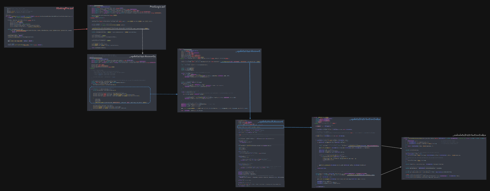
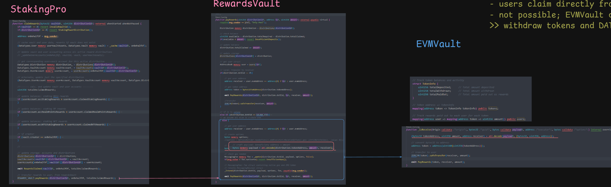

# Overview

StakingPro is a contract that allows users to stake tokens, nfts and earn rewards.

- Users stake MOCA tokens, MocaNFTs, and Realm Points (RP) into vaults to earn rewards.
- Each vault is created by a MocaNFT holder who locks a certain amount of NFTs and sets the fee structure.
- Vaults have no expiry date unless deactivated by the creator.
- Vault levy fees on the rewards it accrues.
- Rewards come in the form of ERC20 tokens and Staking Power (an off-chain resource).
- There are no limits on the amount of assets that can be staked.
- The contract does not issue receipt tokens (e.g. stkMOCA) for staked assets.

MocaNfts are bridge over from Mainnet to Base via NftLocker/Registry pair of contracts.

MocaTokens will be bridged over from Mainnet to Base via LayerZero.

RealmPoints are and off-chain resource, that is "onboarded" to the contract via signatures.

## Versioning

- StakingPro will be initially deployed on Base, paired with a RewardsVaultV1.sol contract.
- Subsequently, StakingPro will be updated with paired with a RewardsVaultV2.sol contract.

# Distributions, Vaults and Accounts

## Distributions

A distribution is a schedule for distributing token rewards to users for a defined period of staking activity.

Attributes of a distribution:

```solidity
    struct Distribution {
        uint256 distributionId;  // 0 for staking power
        uint256 TOKEN_PRECISION; // cannot be 0. min 1e0

        uint256 endTime;
        uint256 startTime;
        uint256 emissionPerSecond;        

        uint256 index;
        uint256 totalEmitted;
        uint256 lastUpdateTimeStamp;  

        // state
        uint256 manuallyEnded;
    }
```

Each distribution has an id. This allows for two different distributions to have the same token, but different distribution schedules.

StakingPro, allows for tokens to be distributed x-chain - that would be identified and handled by the rewards vault contract. Specifically RewardsVaultV2.sol.
RewardsVaultV1.sol only support local chain distribution.

>Distribution ids are expected to be sequential, starting from 0.

Note that since each distribution could have a different token precision, it is important to ensure that the token precision is correctly set and handled for each distribution. We elaborate on this in the section on handling varying decimal precisions of reward tokens.

Note that distributionId:0 is reserved for staking power.

### Staking Power

Staking power is distributionId:0.

- only distribution allowed to have an indefinite endTime
- only distribution that does not emit token rewards

Staking power is an off-chain resource - the contract only serves to record the allocation and distributions to users.

- not meant to be claimed by users.
- not represented as an ERC20 token.

## Vaults

A vault is a collection of staked assets by users:

- users create vaults for staking.
- users stake into vaults.
- users unstake from vaults.

Each vault has a unique id, that is generated randomly. See `_generateVaultId()`.

A vault can be thought of as a unique grouping of boosting effects and fees:

- nfts staked contribute boosting effects to other staking assets: staked tokens, staked RealmPoints
- fees are levied on the rewards accrued by the vault
- vault creator determines fees on vault creation and is free to update them, at any point in time.

We will explain boosting and fees in later sections.

## Accounts [user, vault]

There are two types of accounts:

1. User accounts
2. Vault accounts

Since there could be multiple distributions, each with their own token rewards, there will be a unique vault account for each distribution.

- Vault account will record the vault's accrued and claimed rewards for that specific distribution.
- Will track the total rewards earned by the vault before fees are deducted.

Similarly, each user who stakes in a vault will have a user account per distribution that tracks:

- Their share of the vault's rewards after fees
- Their claimed rewards from that distribution
- The index used to calculate their rewards, which helps determine unclaimed rewards

This dual account system allows precise tracking of rewards at both the vault and individual user level across multiple reward distributions.

### User accounts: pairwise combination of vault and distribution

**Each user account records the user's accrued and claimed rewards for that specific vault and distribution.**

Example:

- 2 distributions: d0, d1
- 2 vaults: vA, vB

User 1 has staked into both vaults. User 1 has the following accounts:

- vA_d0: User 1's account for vault vA and distribution d0
- vA_d1: User 1's account for vault vA and distribution d1
- vB_d0: User 1's account for vault vB and distribution d0
- vB_d1: User 1's account for vault vB and distribution d1

A user will have a unique user account for each pair-wise combination of vault and distribution.

This is because each vault is a unique grouping of boosting effects, fees and therefore rewards accrued. Hence this approach.

>By this point, it should be clear that while for each distribution, a vault has a unique vaultAccount, a user has a unique userAccount for each vault.
>Implying, that if a user has staked into multiple vaults, they will have multiple userAccounts, for the same distribution.

## Update process for vaultAccount and userAccount, for a specific vault & distribution

Before enacting a state change upon a vault (e.g. stake/unstake, etc), the vault account must be updated first.
Consider the example where we want to stake to a vault. The process is as follows:

1. update all active distributions
2. update all vault accounts for specified vault [per distribution]
3. update all user accounts for specified vault  [per distribution]
4. book stake and update vault assets

The vault account is updated first, accounting for boosting effects and fees. I.e. the vault considers its boosted balance relative to the total boosted balance of all vaults, to calculate the rewards accrued by the vault.

The user account is updated next, accounting for the user's share of the rewards accrued by the vault.

- The user account considers its unboosted balance relative to the vault's total unboosted balance, to calculate the rewards accrued by the user.
- This is because all users within the same vault enjoy the same NFT_MULTIPLIER effects.

*Illustration:*



Link to the illustration: https://link.excalidraw.com/l/ZeH3y0tOi6/8T00wtHkie9

## Fees and rewards

Fees are levied on the vault's accrued rewards, before the rewards are distributed to the vault's stakers.

- creatorFee: levied to pay for the creation of the vault
- nftStakingFee: levied to pay for the staking of NFTs
- rpStakingFee: levied to pay for the staking of RP

- Fees set on creation cannot exceed `MAXIMUM_FEE_FACTOR`.
- For fee updates, creator fee must be decreased to allow for increased nftStakingFee and rpStakingFee.
- Alternatively, creator fee can be decreased singularly.
- Irrespective of the fees set, `MAXIMUM_FEE_FACTOR` must be honoured.

Accrued vault rewards are paid out to it's stakers of moca tokens.

- moca stakers earn rewards less of fees; be it token rewards or staking power.
- `(10_000 - totalFeeFactors)` = proportion of rewards given to Moca stakers.

Hence, it can be said that the rewards due to the vault's moca stakers are the rewards accrued, less of fees.

# Handling varying decimal precisions of reward tokens and staking assets

Handling varying decimal precision for reward tokens, and ensuring that the index and emission calculations are correct.

Staking Assets:

- Moca: 1e18
- Realm Points: 1e18
- NFTs: N/A

Staking power is treated in 1e18 precision.

## 1. Decimal Precision for indexes and rewards

All indexes, rewards, fees are recorded in `1E18` precision.
Rewards are rebased to its native precision before being being transferred to the user, as per `claimRewards`.

While this has no impact on tokens of 1e18 precision, it is much more sympathetic towards tokens of lesser precision and does not subject them to intermediate rebasing actions which will result in compounded rounding down effect.

Downside, tokens > 1E18 precision suffer; but there aren't many of those, so its acceptable.

### Check and test if precision loss is a problem, given varying token precisions:

Scenario 1: reward tokens are denominated in 1e1 precision

```solidity
        function indexPrecision() public pure returns(uint256) {
        
        uint256 totalBalance = 1.23 ether;
        uint256 distribution_TOKEN_PRECISION = 1e1;
        
        // totalBalanceRebased = 12
        uint256 totalBalanceRebased = (totalBalance * distribution_TOKEN_PRECISION) / 1E18;

        //note: indexes are denominated in the distribution's precision
        //assume first update, distribution_index = 0
        uint256 distribution_index = 0;
        
        // assume emissionPerSecond is 1 unit of reward token
        uint256 emittedRewards = (1 * distribution_TOKEN_PRECISION) * 1;      // emittedRewards = distribution.emissionPerSecond * timeDelta: 
        // emittedRewards = 10

        uint256 nextDistributionIndex = ((emittedRewards * distribution_TOKEN_PRECISION) / totalBalanceRebased) + distribution_index; 

        // nextDistributionIndex = 8 = ((10 * 10) / 12) + 0
        return nextDistributionIndex;   
    }  
```

`nextDistributionIndex` = 0.8 units of reward tokens per unit MOCA staked
We intended to distribute 1 reward token per unit MOCA staked. But ended up distributing 0.8 reward tokens per unit MOCA staked.

check if correct:

    - mocaStaked: 1.23e18
    - emittedRewards = 1 unit of reward token, in 1e1 precision [10]

    - mocaStakedRebased: (1.23e18 * 1e1) / 1e18 = 12
    - rewardsPerMocaStakedRebased: (emittedRewards * rewardPrecision) / mocaStakedRebased = (10 * 1e1) / 12 = 8 
    
    0.8 reward tokens are given out per stakedMoca. [since 1 unit is 1e1]
    0.8 * 1.23 = 0.984 reward tokens ought to be emitted in TOTAL 
    slightly lesser than the 1 reward token that was meant to be emitted 

Scenario 2: reward tokens are denominated in 1e21 precision

```solidity
    function indexPrecision2() public pure returns(uint256) {
        
        uint256 totalBalance = 1.23 ether;
        uint256 distribution_TOKEN_PRECISION = 1e21;
        
        // totalBalanceRebased = 1230000000000000000000 = 1.23e21
        uint256 totalBalanceRebased = (totalBalance * distribution_TOKEN_PRECISION) / 1E18;

        //note: indexes are denominated in the distribution's precision
        //assume first update, distribution_index = 0
        uint256 distribution_index = 0;
        
        // assume emissionPerSecond is 1 reward token
        uint256 emittedRewards = (1 * distribution_TOKEN_PRECISION) * 1;      // emittedRewards = distribution.emissionPerSecond * timeDelta: 
        // emittedRewards = 1000000000000000000000 = 1e21

        uint256 nextDistributionIndex = ((emittedRewards * distribution_TOKEN_PRECISION) / totalBalanceRebased) + distribution_index; 
        
        // nextDistributionIndex = 0.813008130081300813008 = ((1e21 * 1e21) / 1.23e21) + 0
        return nextDistributionIndex;   
    }  
```

`nextDistributionIndex` = 0.813008130081300813008 units of reward tokens per unit MOCA staked
We intended to distribute 1 reward token per unit MOCA staked. But ended up distributing 0.813008130081300813008 reward tokens per unit MOCA staked.

check if correct:

    - mocaStaked: 1.23e18
    - emittedRewards = 1 unit of reward token, in 1e21 precision [1e21]

    - mocaStakedRebased: (1.23e18 * 1e21) / 1e18 = 1.23e21
    - rewardsPerMocaStakedRebased: (emittedRewards * rewardPrecision) / mocaStakedRebased = (1e21 * 1e21) / 1.23e21 = 0.813008130081300813008
    
    0.813008130081300813008 reward tokens are given out per stakedMoca. [since 1 unit is 1e21]
    0.813008130081300813008 * 1.23 = 0.99999999999999999999984 reward tokens ought to be emitted in TOTAL 
    slightly lesser than the 1 reward token that was meant to be emitted 

**CONCLUSION: Regardless of the precision of the reward tokens, and its impact on index calculation, the total rewards emitted will be slightly lesser than the intended amount. This is fine.**

There should not be any issues with rewards and index calculations, as long as none of the following variables are zero:

- `timeDelta`
- `distribution.emissionPerSecond`
- `distribution.TOKEN_PRECISION`
- `totalBalance`: which could be either `totalBoostedRealmPoints` or `totalBoostedStakedTokens` [in `_updateDistributionIndex`]
- `boostedBalance`: which could be either `vault.boostedRealmPoints` or `vault.boostedStakedTokens` [in `_updateVaultAccount`]
- `user.stakedTokens`: in `_updateUserAccount`

## 2. Decimal Precision for feeFactors and NFT multiplier

`PRECISION_BASE` is expressed as `10_000`, for 2dp precision.

This applies to fee factors and NFT multiplier.

`PRECISION_BASE` is set to `10_000`.
This is used to express fee factors and NFT multiplier in 2dp precision (XX.yy%).

**On 2dp a base:**
- 100% : 10_000
- 50%  : 5000
- 1%   : 100
- 0.5% : 50
- 0.25%: 25
- 0.05%: 5
- 0.01%: 1

### 2.1 NFT Multiplier

Therefore for an nft multiplier of 10%, `NFT_MULTIPLIER` must be set to `1000`, when `PRECISION_BASE` is expressed as `10_000`.
Increasing `NFT_MULTIPLIER` beyond `10_000` changes the boost from fractional to whole number (e.g., `20_000` = 200% boost).

```solidity
        // calc. boostedStakedTokens
        uint256 incomingBoostedStakedTokens = (amount * vault.totalBoostFactor) / PRECISION_BASE;
```

Example:

```solidity
    function ret() external pure returns(uint256) {
        
        uint256 PRECISION_BASE = 10_000;
        
        uint256 vaultTotalBoostFactor = PRECISION_BASE; //init at 100%  

        uint256 NFT_MULTIPLIER = 1000;                     // 10% = 1000/10_000 = 1000/PRECISION_BASE 
        vaultTotalBoostFactor = vaultTotalBoostFactor + (1 * NFT_MULTIPLIER);   // 10_000 + 1000 = 11_000
        
        uint256 amount = 10;
        uint256 incomingBoostedStakedTokens = (amount * vaultTotalBoostFactor) / PRECISION_BASE; // amount * (11_000/10_000) = amount * 11

        return incomingBoostedStakedTokens; // RETURNS 11
    }
```

Exceeding `10_000` is acceptable for NFT_MULTIPLIER, and it can still retain 2dp precision.

```solidity
    function nftPrecision() public pure returns(uint256) {
        
        uint256 PRECISION_BASE = 10_000;
        
        uint256 amount = 1 ether;
        uint256 vault_totalBoostFactor = 20_050 * 1;  // assume 1 nft staked
        // 20_050 = 200.5%

        uint256 incomingBoostedStakedTokens = (amount * vault_totalBoostFactor) / PRECISION_BASE;

        return incomingBoostedStakedTokens;
        // 1 ether: 2005000000000000000 = 2.005 tokens 
        // 1.23 ether: 2466150000000000000 = 2.46615 tokens -> 200.5%
    }
```

**In the above example, by setting `NFT_MULTIPLIER` to `20_050`, we are able to retain 2dp precision; which is reflective of 200.5% boost.**

### 2.2 Fee Factors

Fee factors cannot exceed `MAXIMUM_FEE_FACTOR`.
In `createVault`, we check if the total fee factor exceeds `MAXIMUM_FEE_FACTOR`:

```solidity
        uint256 totalFeeFactor = fees.nftFeeFactor + fees.creatorFeeFactor + fees.realmPointsFeeFactor;
        if(totalFeeFactor > MAXIMUM_FEE_FACTOR) revert TotalFeeFactorExceeded();
```

**This is to ensure that MOCA stakers receive at least 50% of rewards.**

In `_updateUserAccount`, we calculate the fees accrued by the user:

```solidity
    // calc. creator fees
    if(vault.creatorFeeFactor > 0) {
        // fees are kept in 1E18 during intermediate calculations
        accCreatorFee = (totalAccRewards * vault.creatorFeeFactor) / params.PRECISION_BASE;
    }

    // nft fees accrued only if there were staked NFTs
    if(vault.stakedNfts > 0) {
        if(vault.nftFeeFactor > 0) {

            // indexes are denominated in 1E18 | fees are kept in 1E18 during intermediate calculations
            accTotalNftFee = (totalAccRewards * vault.nftFeeFactor) / params.PRECISION_BASE;
            vaultAccount.nftIndex += (accTotalNftFee / vault.stakedNfts);      // nftIndex: rewardsAccPerNFT            
        }
    }

    // rp fees accrued only if there were staked RP 
    if(vault.stakedRealmPoints > 0) {
        if(vault.realmPointsFeeFactor > 0) {

            // indexes are denominated in 1E18 | fees are kept in 1E18 during intermediate calculations | realmPoints are denominated in 1E18
            accRealmPointsFee = (totalAccRewards * vault.realmPointsFeeFactor) / params.PRECISION_BASE;
            vaultAccount.rpIndex += (accRealmPointsFee * 1E18) / vault.stakedRealmPoints;      // rpIndex: rewardsAccPerRP
        }
    } 
```

### 2.3 Precision_Base reference

If we only wanted to express fee factors in integer values, (meaning 0 precision), we could set `PRECISION_BASE` to `100`.

- 100% : 100
- 50%  : 50
- 1%   : 1
- 0.5% : 5
- 0.25%: 2.5
- 0.05%: 0.5
- 0.01%: 0.1

---

# Contract Walkthrough

## Constructor & Initial setup

```solidity
    constructor(
        address nftRegistry, address stakedToken, uint256 startTime_, 
        /*uint256 maxFeeFactor, uint256 minRpRequired,*/ uint256 nftMultiplier, 
        uint256 creationNftsRequired, uint256 vaultCoolDownDuration,
        address owner, address monitor, address operator,
        address storedSigner, string memory name, string memory version) payable EIP712(name, version) {...}
```

On deployment, the following must be defined:

1. address of nft registry 
2. address of staked token [MOCA]
3. startTime:
    - user are only able to call staking functions after startTime.
    - Must be greater than current block timestamp.
4. nftMultiplier: multiplier factor per nft.
    - Must be greater than 0. Used to calculate rewards boost from staked NFTs
5. creationNftsRequired
6. vaultCoolDownDuration
7. owner: address that will be granted `DEFAULT_ADMIN_ROLE`, `OPERATOR_ROLE` and `MONITOR_ROLE`.
8. monitor: address that will be granted `MONITOR_ROLE` for calling `pause()`.
9. operator: address that will be granted `OPERATOR_ROLE` for parameter updates.
10. storedSigner: address used for signature verification.
11. name: name string used for EIP712 domain separator
12. version: version string used for EIP712 domain separator

This expects that the nft registry contract should be deployed in advance.

After deployment, we need to:

1. Deploy RewardsVault contract
2. Set RewardsVault address on stakingPro contract
3. Call `setPool` on NftRegistry contract

## Roles & Addresses

Addresses:

1. Owner multiSig
2. Risk monitoring script [EOA]
3. Operator [EOA]

Roles:

1. `MONITOR_ROLE`: can only call `pause();` for risk monitoring scripts
2. `OPERATOR_ROLE`: for update various pool parameters and `stakeOnBehalfOf()`
3. `DEFAULT_ADMIN_ROLE`: Owner multiSig; can assign/revoke roles to other addresses

> Roles are referred to by their `bytes32` identifier

Note:

1. Admins can add other admins.
2. Admins can grant and revoke roles to any addresses.
3. The only way for an admin to lose its admin role is to renounce from it.

By default, the admin role for all roles is `DEFAULT_ADMIN_ROLE`, which means that only accounts with this role will be able to grant or revoke other roles.
The `DEFAULT_ADMIN_ROLE` is also its own admin: it has permission to grant and revoke this role.

While the `DEFAULT_ADMIN_ROLE` is global admin, it does not mean it has access to call the other roles' functions.
it can only set/revoke roles to addresses. if we want it to be able to call these restricted functions, it must grantRole to itself.

### Owner multiSig address is assigned:

1. `MONITOR_ROLE`
2. `OPERATOR_ROLE`
3. `DEFAULT_ADMIN_ROLE`

With the default admin role, it can assign/revoke roles to other addresses.
With the monitor role, it can call `pause();` to pause the contract.
With the operator role, it can call update various pool parameters and `stakeOnBehalfOf()`.

### Risk monitoring script address is assigned:

1. `MONITOR_ROLE`

With the monitor role, it can call `pause();` to pause the contract.

### Operator address is assigned:

1. `OPERATOR_ROLE`

With the operator role, it can call update various pool parameters.
On deployment, no operator address is assigned. When required, the DAT team is to call `grantRole(bytes32 role, address account)` to assign the operator role to the supplied address.

Once the necessary changes are made, the operator address is to call `revokeRole(bytes32 role, address account)` to revoke the operator role from itself.
This is to ensure that the operator role is kept unassigned, unless it is required.

## Pool States

- ended
- paused/unpaused
- frozen
- underMaintenance

1. ended: contract is ended, as dictated by its endTime. Users can only claim rewards and unstake.
2. paused: contract is paused, all user functions revert.
3. frozen: contract is frozen, all user functions revert except for emergencyExit().
4. underMaintenance: contract is under maintenance, all user functions revert. Other privileged functions are also blocked.

### Pause/Unpause

Pausing should be used to verify any potential security issues.

- If they are not found, the contract can be unpaused.
- If there are security issues, the contract is frozen.

### Frozen

Contract is set to `frozen` when there are irreparable issues with the contract.
This is to prevent any further damage to the contract, and to ensure that the contract is not used anymore.

Once frozen, users can only call `emergencyExit()`, which will allow users to reclaim their principal staked assets.
Any unclaimed rewards and fees are forfeited.

Note: `emergencyExit()` assumes that the contract is broken and any state updates made to be invalid; hence it does not update rewards and fee calculations.

### Under Maintenance

Contract is set to `underMaintenance` when there is a need to update the NFT_MULTIPLIER value.

Process:
    1. enableMaintenance
    2. updateDistributions
    3. updateAllVaultAccounts
    4. updateNftMultiplier
    5. updateBoostedBalances
    6. disableMaintenance

Setting the contract to `underMaintenance` will prevent users from staking, unstaking, claiming rewards, or creating new vaults.
This is to ensure that the NFT_MULTIPLIER is updated correctly, and that the boosted balances are updated correctly.

### Why have both states [paused & underMaintenance]?

- maintenance fns should not be callable during a paused state.
- consider the case when a security event occurs during maintenance mode
- maintenance should not be allowed to continue, should stop to assess the situation.

We want the risk controls to be able to override and lock the contract if an issue occurs during maintenance process.

# User functions

## createVault

```solidity
createVault(
    uint256[] calldata tokenIds, 
    uint256 nftFeeFactor, 
    uint256 creatorFeeFactor, 
    uint256 realmPointsFeeFactor) external whenStartedAndNotEnded whenNotPaused whenNotUnderMaintenance
```

Creates a new vault for staking with specified fee parameters:

- `nftFeeFactor`: fee factor per nft
- `creatorFeeFactor`: fee factor for creator
- `realmPointsFeeFactor`: fee factor for realm points

Requires the creator to have the required number of creation NFTs

- creation NFTs are registered on the NFT_REGISTRY contract, and are locked.
- creation NFTs do not count towards rewards calculations.

**Known and accepted behaviour: Vault can be created, and immediately, creator can call activateCooldown() to make it cooldown.**

## stakeTokens

```solidity
stakeTokens(bytes32 vaultId, uint256 amount) external whenStartedAndNotEnded whenNotPaused whenNotUnderMaintenance
```

Allows users to stake tokens into a specified vault:

- Checks that the vault exists and is not ended
- Transfers tokens from user to contract

## stakeNfts

```solidity
stakeNfts(bytes32 vaultId, uint256[] calldata tokenIds) external whenStartedAndNotEnded whenNotPaused whenNotUnderMaintenance
```

Allows users to stake NFTs into a specified vault:

- Checks that the vault exists and is not ended
- Calls NFT_REGISTRY.checkIfUnassignedAndOwned(), to check if the NFTs are unassigned and owned by the user
- Calls NFT_REGISTRY.recordStake(), to record vault assignment so that the NFTs cannot be staked in another vault

The staked NFTs contribute to boosting the vault's staked Tokens and Realm Points, which determines its share of rewards from active distributions.

## stakeRP

```solidity
stakeRP(bytes32 vaultId, uint256 amount, uint256 expiry, bytes calldata signature) external whenStartedAndNotEnded whenNotPaused whenNotUnderMaintenance
```

Allows users to stake Realm Points into a specified vault:

- Checks that the vault exists and is not ended
- Amount must be greater than `MINIMUM_REALMPOINTS_REQUIRED`
- Signature must not be expired or already executed
- Signature must be valid and from the stored signer

While OZ's ECDSA.sol::recover() handles signature malleability, we incorporate a nonce to prevent race conditions.
I.e. multiple payloads with same nonce for a user can only be executed once.

Hence, the mapping `mapping(address user => uint256 nonce) public userNonces;`, reflects the next nonce for a user.
All prior nonces have been used up.

> [signature malleability](https://github.com/kadenzipfel/smart-contract-vulnerabilities/blob/master/vulnerabilities/signature-malleability.md)

## migrateRP

```solidity
migrateRP(bytes32 oldVaultId, bytes32 newVaultId, uint256 amount) external whenStartedAndNotEnded whenNotPaused whenNotUnderMaintenance 
```

Allows users to migrate their staked RP from one vault to another:

- Checks that the old vault exists
- Checks that the new vault exists and is not ended
- Migrates the specified amount of staked RP from the old vault to the new vault

## unstake

```solidity
unstake(bytes32 vaultId, uint256 amount, uint256[] calldata tokenIds) external whenStarted whenNotPaused whenNotUnderMaintenance
```

Allows users to unstake their staked tokens and Nfts from a specified vault:

- Checks that the vault exists and is not ended
- Unstakes the specified amount of staked tokens and/or Nfts
- Updates NFT_REGISTRY to record unstake (NFT_REGISTRY.recordUnstake)
- Users are able to unstake even if the contract's end time has been exceeded.

**Will revert w/o error if the tokenIds provided are not staked by the user.**

- The dynamic nature of the fn limits how many Nfts can be unstaked at once, due to gas cost involving array manipulations. 
- The greater the number of Nfts needed to be unstaked at once, will result in increasing gas costs.
- This has no impact on unstaking tokens.

## claimRewards

```solidity
claimRewards(bytes32 vaultId, uint256 distributionId) external whenStarted whenNotPaused whenNotUnderMaintenance
```

Allows users to claim rewards from a specified vault:

- Checks that the distributionId is not 0.
- Calls RewardsVault to transfer rewards to the user

**Users are able to claim rewards even if the contract's end time has been exceeded.**


## updateVaultFees

```solidity
updateVaultFees(bytes32 vaultId, uint256 nftFeeFactor, uint256 creatorFeeFactor, uint256 realmPointsFeeFactor) external whenStartedAndNotEnded whenNotPaused whenNotUnderMaintenance
```
Updates the vault fee structure. Only the vault creator can update fees, with restrictions:

- Creator can only decrease their creator fee factor (but may increase other fees proportionally)
- Total fees (NFT + creator + realm points) cannot exceed `MAXIMUM_FEE_FACTOR`

## activateCooldown

```solidity
activateCooldown(bytes32 vaultId) external whenStartedAndNotEnded whenNotPaused whenNotUnderMaintenance
```

Activates the cooldown period for a vault:

- If `VAULT_COOLDOWN_DURATION` is 0, vault is immediately removed from circulation
- When removed, all vault's staked assets are deducted from global totals

If `VAULT_COOLDOWN_DURATION` is of non-zero value, the vault's endTime is set to `block.timestamp` + `VAULT_COOLDOWN_DURATION`.
While this sets the endTime of the vault, it does not necessarily mean that the vault will be removed from circulation immediately.
That would be handled by the `endVaults()` function.

## endVaults

```solidity
endVaults(bytes32[] calldata vaultIds) external whenStartedAndNotEnded whenNotPaused whenNotUnderMaintenance
```

- Ends multiple vaults
- Removes all staked assets from circulation and updates global totals
- Callable by anyone; no access control restrictions
- Checks if endTime was set, as per `activateCooldown()`, else skips to next vault

# Pool Management functions

`OPERATOR_ROLE` is required to call the following functions:

## stakeOnBehalfOf

```solidity
stakeOnBehalfOf(bytes32[] calldata vaultIds, address[] calldata onBehalfOfs, uint256[] calldata amounts) external whenStartedAndNotEnded whenNotPaused whenNotUnderMaintenance onlyRole(OPERATOR_ROLE)
```

Allows the operator/owner to stake on behalf of users:

- Checks that the vault exists and is not ended
- Transfers tokens from the function caller to the contract

## setEndTime

```solidity
setEndTime(uint256 endTime_) external whenNotEnded whenNotPaused onlyRole(OPERATOR_ROLE)
```

- endTime can be moved forward or backward; as long its a future timestamp
- Only callable when contract is not ended or frozen

> fn updates the endTime of active distributions that have far-dated endTimes(> endTime_)
> on repeated calls, where the endTime is extended then shorted, we may want to separately update the endTime of the distributions

## setRewardsVault

```solidity
setRewardsVault(address newRewardsVault) external whenNotEnded whenNotPaused onlyRole(OPERATOR_ROLE)
```

- Updates the rewards vault address; cannot be set to a zero address
- Only callable when contract is not ended or frozen
- Should only be updated when there are no active distributions, else reverts and txn fails will occur.

Key aspects:

- Allows deploying enhanced rewards vault contracts without modifying StakingPro
- Preserves all staked assets and earned rewards
- Takes effect immediately for future reward distributions

This provides flexibility to upgrade reward distribution logic while maintaining core staking functionality.

## updateMaximumFeeFactor

```solidity
updateMaximumFeeFactor(uint256 newFactor) external whenNotEnded whenNotPaused onlyRole(OPERATOR_ROLE)
```

- Updates the storage variable `MAXIMUM_FEE_FACTOR`; which is referenced in `updateVaultFees()`.
- Can increase/decrease it to dictate total possible fees on a vault. 
- Zero amount not allowed.

> Moca stakers receive at rewards less of fees.

## updateMinimumRealmPoints

```solidity
updateMinimumRealmPoints(uint256 newAmount) external whenNotEnded whenNotPaused onlyRole(OPERATOR_ROLE)
```

- Updates the storage variable `MINIMUM_REALMPOINTS_REQUIRED`; which is referenced in `stakeRP()`.
- Can increase/decrease it to adjust the barrier to entry.
- Zero amount not allowed.

## updateCreationNfts

```solidity
updateCreationNfts(uint256 newAmount) external whenNotEnded whenNotPaused onlyRole(OPERATOR_ROLE)
```

- Updates the storage variable `CREATION_NFTS_REQUIRED`; which is referenced in `createVault()`.
- Zero values are accepted, allowing vault creation without NFT requirements.

## updateVaultCooldown

```solidity
updateVaultCooldown(uint256 newDuration) external whenNotEnded whenNotPaused onlyRole(OPERATOR_ROLE)
```

- Updates the storage variable `VAULT_COOLDOWN_DURATION`; which is referenced in `activateCooldown()`.
- Zero values are accepted, allowing vaults to be ended immediately.

## setupDistribution

```solidity
setupDistribution(uint256 distributionId, uint256 distributionStartTime, uint256 distributionEndTime, uint256 emissionPerSecond, uint256 tokenPrecision,
        uint32 dstEid, bytes32 tokenAddress
    ) external whenNotEnded whenNotPaused onlyRole(OPERATOR_ROLE) 
```

Creates a new distribution with specified parameters:

- distributionId: Unique identifier for the distribution
- distributionStartTime: When distribution begins emitting rewards
- distributionEndTime: When distribution stops emitting rewards
- emissionPerSecond: Rate of reward token emissions
- tokenPrecision: Decimal precision of the reward token (e.g. 1e18)
- dstEid: EID of the destination chain
- tokenAddress: Address of the reward token

### Staking Power

- Distribution Id 0 is reserved for staking power
- It can be set to have indefinite endTime.
- Does not require a dstEid or tokenAddress.

### Token setup

- both start and end times must be defined
- else, we would be emitting token rewards indefinitely
- calls RewardsVault to setup the Distribution there as well
- does not expect tokens to have been deposited; that comes after the distribution is setup

### LayerZero

- dstEid: EID of the destination chain
- tokenAddress: Address of the reward token

Use of bytes32 for tokenAddress is to standardize across evm and non-evm chains.

### Staking power setup

- distributionId: 0
- token precision: 1e18

startTime should be the same as stakingPro. endTime to be left as 0.

staking power will be identified by its distribution id as 0, throughout the contract.

### Token setup

- both start and end times must be defined
- else, we would be emitting token rewards indefinitely
- stakingPro does not check if tokens have been deposited or not; it will only make a call to RewardsVault contract to transfer


## updateDistribution

```solidity
updateDistribution(uint256 distributionId, uint256 newStartTime, uint256 newEndTime, uint256 newEmissionPerSecond) external whenNotEnded whenNotFrozen onlyRole(OPERATOR_ROLE)
```

Allows modification of parameters of an existing distribution:

- distributionId: ID of the distribution to update
- newStartTime: Can only be modified if distribution hasn't started yet. Must be in the future.
- newEndTime: Can be extended or shortened, but must be after current timestamp [`newEndTime > block.timestamp`]
- newEmissionPerSecond: Can be modified at any time to adjust reward rate

Key constraints:

- At least one parameter must be modified (non-zero)
- Cannot modify start time after distribution has begun
- New end time must be after start time
- Cannot set emission rate to 0
- Cannot modify ended distributions

This function enables flexible management of reward distributions by allowing adjustments to timing and emission rates while maintaining key invariants.

## endDistributionImmediately

```solidity
endDistributionImmediately(uint256 distributionId) external whenNotEnded whenNotFrozen onlyRole(OPERATOR_ROLE)
```

Allows owner to immediately terminate an active distribution:

- distributionId: ID of the distribution to end
- Enables emergency termination of a distribution by setting its end time to the current block timestamp. 
- Effectively stops any further rewards from being distributed while preserving all rewards earned up to that point.
- Distribution must exist and be active (not ended).
- Calls RewardsVault to set the flag `manuallyEnded=1`

This provides an emergency mechanism to halt reward distributions if needed, while ensuring already-earned rewards remain claimable.

# Maintenance Mode functions [To update: NFT_Multiplier]

    /**    
        1. enableMaintenance
        2. updateActiveDistributions
        3. updateAllVaultAccounts
        4. updateNftMultiplier
        5. updateBoostedBalances
        6. disableMaintenance
     */

- First we update all active distributions to current timestamp.
- Relative to the snapshot, we update each vault's account, for each distribution.
- Regardless how long the updateAllVaultAccounts takes, we will not update the distribution data again.
- Since vault accounts accruals are calculated relative to the distribution indexes (i.e. delta btw v.Index and d.Index), there will not be any drift, due to time passing.
- Essentially, we are taking a snapshot of the distribution data at the start of the maintenance mode, and updating the vault accounts relative to this snapshot.
- Regardless how long updating all the vault accounts takes, the snapshot remains constant, so effectively we are updating everything to the same timestamp.
- Whatever time the update process takes, distributions will be next updated to book this period and its rewards, under the updated boosted balances.

**This is important to note that if `updateActiveDistributions` is called again, we must restarted the entire process with updating all vault accounts, as our reference point has changed.**

## Risk Management

- The expectation is that there OPERATOR_ROLE is only assigned to the owner multiSig at rest.
- When there is requirement to call these functions, the owner multiSig will assign and EOA address to the OPERATOR_ROLE.
- This EOA address is expected to be a trusted address, and will be used to power a script that will call these functions.
- Once the update process is complete, the EOA will renounce the OPERATOR_ROLE.
- Owner multiSig will continue to hold the MONITOR_ROLE.

## enableMaintenance

```solidity
enableMaintenance() external whenNotPaused whenNotUnderMaintenance onlyRole(OPERATOR_ROLE) 
```

- Enables maintenance mode, which disables all user functions.
- Only callable when contract is not paused.

## disableMaintenance

```solidity
disableMaintenance() external whenNotPaused whenUnderMaintenance onlyRole(OPERATOR_ROLE)
```

- Disables maintenance mode, which re-enables all user functions.
- Only callable when contract is not paused.

## updateActiveDistributions

```solidity
updateActiveDistributions() external whenNotEnded whenNotPaused whenUnderMaintenance onlyRole(OPERATOR_ROLE)
```

- Updates all active distributions to current timestamp
- This ensures all rewards are properly calculated and booked

**Note that an active distribution may be popped as part of this update process. This is why we we specify the distributionIds when calling updateAllVaultAccounts.**

## updateAllVaultAccounts

```solidity
updateAllVaultAccounts(bytes32[] calldata vaultIds, uint256 distributionId) external whenNotEnded whenNotPaused whenUnderMaintenance onlyRole(OPERATOR_ROLE)
```

- Updates all vault accounts for a specified distribution
- Operator must be careful to ensure that distributionIds are specified comprehensively, covering both active and recently popped distributions.
- This ensures all rewards are properly calculated and booked
- Only callable when contract is under maintenance.

## updateNftMultiplier

```solidity
updateNftMultiplier(uint256 newMultiplier) external whenNotEnded whenNotPaused whenUnderMaintenance onlyRole(OPERATOR_ROLE)
```

- Updates the NFT multiplier
- Only callable when contract is under maintenance.

## updateBoostedBalances

```solidity
updateBoostedBalances(bytes32[] calldata vaultIds) external whenNotEnded whenNotPaused whenUnderMaintenance onlyRole(OPERATOR_ROLE)
```

- This function is expected to be called multiple times, until all vaults have been updated to use the latest `NFT_MULTIPLIER` value
- Also updates the global boosted balances, based on the delta of the update to vault's boosted balances

**After cycling through all vaults, we should sanity check that the updated global boosted balances match up with the expected values. If they do not match up, we should end the contract and redeploy.**

# Risk Management functions

## pause

```solidity
pause() external whenNotPaused onlyRole(MONITOR_ROLE)
```
- pause contract
- only callable by MONITOR_ROLE
- MONITOR_ROLE is expected to be assigned to the monitoring script as well as owner multiSig

## unpause

```solidity
unpause() external whenPaused onlyRole(DEFAULT_ADMIN_ROLE)
```

- unpause contract
- only callable by DEFAULT_ADMIN_ROLE

## freeze

```solidity
freeze() external whenPaused onlyRole(DEFAULT_ADMIN_ROLE)
```

- freeze contract
- only callable by DEFAULT_ADMIN_ROLE

## emergencyExit

Assuming black swan event, users call `emergencyExit` to exit.

1. pause(): all user fns are disabled
2. freeze(): cannot unpause; only emergencyExit() can be called
3. emergencyExit(): exfil all principal assets

```solidity
emergencyExit(bytes32[] calldata vaultIds, address onBehalfOf) external whenStarted 
```

- only callable when contract is paused and frozen
- callable by users to exfil their assets
- Rewards and fees are not withdrawn; indexes are not updated. Preserves state history at time of failure.

- This allows users to recover their principal assets in a black swan event.
- It does not allow users to recover their rewards or fees.

**This is the contrasting point versus calling `unstakeAll` and `emergencyExit`. Why?**

- The assumption here is that the contract can no longer be trusted, and calculations and updates should not be trusted or engaged with.
- So we only look to recover the principal assets.
- Can worry about calculating what is owed off-chain at our leisure once users assets are secured.

**Function is callable by anyone, but asset transfers are made to the correct beneficiary**

- This is done by checking the `onBehalfOf` address.
- The reason for this is to allow both users and us to call the function, to allow for a swift exit.

# Execution Flow

## 1. Creating a distribution

- `setupDistribution` is called on stakingPro
- has nested call to rewardsVault to communicate necessary values: `totalRequired`, `dstEid`, `tokenAddress`
- `totalRequired` is the total amount of tokens required to be deposited
- `dstEid` is the destination EID, (assuming its a remote token)
- `tokenAddress` is the address of the token to be deposited
- `tokenAddress` is stored as bytes32, to standardize across evm and non-evm chains

Nested call within stakingPro so that we do not have to make 2 independent txns to setup distribution; reducing human error.

**The rewardsVault must be set before any distributions can be created**

- Via `pool.setRewardsVault(address(rewardsVault));`
- If not, distributions cannot be created, as the nested call to rewardsVault will revert.
- Address cannot be set to a zero address.
- If RewardsVault contract is paused, distributions cannot be created or ended, rewards cannot be claimed. [revert]

## 2. Deposit tokens [Financing a distribution]

### Local token

- Token exists on the same chain as the StakingPro
- Address with `MONEY_MANAGER` role to call `deposit()` on rewardsVault
- `deposit(uint256 distributionId, uint256 amount, address from) onlyRole(MONEY_MANAGER_ROLE) external`

### Remote token

- Token exists on a different chain as the StakingPro
- `MONEY_MANAGER` to call `deposit()` on EvmVault, which exists on the remote chain
- `deposit(address token, uint256 amount, address from, uint256 distributionId) external payable onlyOwner`
- This is a LayerZero enabled function, so it is payable
- Will fire off a cross-chain message to the home chain, to update rewardsVault
- `totalDeposited` is incremented on rewardsVault

## 3. Withdraw tokens

### Local token

- MONEY_MANAGER to call withdraw() on rewardsVault
- `withdraw(uint256 distributionId, uint256 amount, address to) onlyRole(MONEY_MANAGER_ROLE) external`

### Remote token

- MONEY_MANAGER to call withdraw() on evmVault, which exists on the remote chain
- `withdraw(address token, uint256 amount, address to, uint256 distributionId) external onlyOwner`
- this is a LZ enabled fn, so it is payable
- will fire off a xchain message to the home chain, to update rewardsVault
- `totalDeposited` is decremented on rewardsVault

## 4. Users claiming Rewards

- User to call `claimRewards()` on StakingPro
- `claimRewards(bytes32 vaultId, uint256 distributionId) external`
- After calculating rewards, will make an external call to rewardsVault to transfer rewards to user
- if the token is local, rewardsVault will transfer the rewards to the user
- if the token is remote, rewardsVault will fire off a xchain message to the remote chain, hitting the evmVault there and instructing it to transfer rewards to the user
- `totalClaimed` is incremented on rewardsVault

Note that the rewardsVault only supports local, other remote evm chains and solana.

## 5. Cooldown & Ending vaults: activateCooldown() and endVaults()

Process:

1. First, the vault creator must activate the cooldown by calling `activateCooldown()`. This sets the end time on a vault.
2. Once the end time is reached, `endVaults()` must be called on the vault. This removes the vault's staked assets from the system and updates the global boosted balances.

### activateCooldown()

- activateCooldown() is called when the vault creator wants to activate the cooldown period of a vault
- this signifies that the vault will come to an end in the near future
- `vault.endTime` is set to `block.timestamp` + `VAULT_COOLDOWN_DURATION`
- once `vault.endTime` is a non-zero value, users would not be able to stake anymore
- however user can continue to claim rewards and unstake at their leisure

### endVaults()

- endVaults() is called when the vault's end time is reached and the weight of its staked assets must be removed from the system
- this prevents assets from accruing rewards and diluting the rewards of the other active vaults
- this is necessary as there is no automated manner for this to occur
- currently this is callable by anyone, with no access control restrictions
- vault's staked assets are removed from the system
- global boosted balances are also decremented

The expectation is that we call endVaults() on all the vaults that have come to an end, via script.

## 6. Updating NFT_MULTIPLIER (enableMaintenance, update, disableMaintenance)

Process:

        1. enableMaintenance
        2. updateDistributions: updates all distribution indexes
        3. updateAllVaultAccounts: updates all vault indexes
        4. updateNftMultiplier: updates NFT multiplier
        5. updateBoostedBalances: updates boosted balances
        6. disableMaintenance

We will need to call `updateBoostedBalances()` multiple times to ensure all vaults have been updated.
During this process, user functions are disabled, as calling them during this process will result in incorrect calculations.

E.g. an unstake() could slip in btw `updateBoostedBalances()` calls and wreck havoc on calculations.

Hence, lock the contract, update, verify that the updated totalBoosted global values tally with the expected values.
If verification fails, end the contract and redeploy.

When all the vaults have been updated to use the latest `NFT_MULTIPLIER` value, `totalBoostedStakedTokens` and `totalBoostedRealmPoints` should match up.
This serves as a sanity check to ensure that the multiplier is updated correctly, as well as the vaults are updated correctly.

Note: `_updateDistributionIndex` returns if paused. This prevents multiple updates to distribution indexes during `updateAllVaultAccounts()`.

## 7. How to end stakingPro and/or migrate to a new stakingPro contract (endTime)

- Set endTime global variable via `setEndTime`.
- Users will be able to call: `unstakeAll` and `claimRewards` after `endTime`.
- `setEndTime` can be called repeatedly, by owner, to update `endTime`.
- `endTime` can be moved forward or backward.

**What if endTime is set, but there are still active distributions continuing beyond endTime?**

- `unstake` and `claimRewards` are callable even after `endTime`.
- Calling these functions after `endTime` would mean that if there are still active distributions, the distributions would be updated via _updateUserAccounts::_updateDistributionIndex.

Hence, when calling `setEndTime`, we should check if there are still active distributions beyond endTime.
If there are, we should end those distributions via `updateDistribution`.

>It is not possible to nest `claimRewards` within `unstakeAll`, as `claimRewards` operates on a per-distribution basis. Hence, 2 functions are needed.

## 9. Ending a distribution

- `endDistributionImmediately(uint256 distributionId)`
- This function enables immediate termination of a distribution by setting its end time to the current block timestamp. 
- This effectively stops any further rewards from being distributed while preserving all rewards earned up to that point.
- Distribution must exist and be active (not ended).

## 10. Migrating from old rewardsVault (V1) to new rewardsVault (V2)

Process:

1. end all active distributions on stakingPro  [users have may unclaimed rewards]
2. switch to rewardsVaultV2
3. setup old distributions on rewardsVaultV2 [via setupDistribution]

Step 3 will require an EOA address to be granted the POOL_ROLE, to be able to call setupDistribution.

Additionally, `totalClaimed` and `totalDeposited` will start from `0` on rewardsVaultV2.
These values will not be migrated over from V1 - so we must be mindful of this when migrating.

# V2: How does RewardsVaultV2 work w/ EVMVault


When claiming rewards for a remote distribution:

1. User calls `claimRewards()` on StakingPro
2. StakingPro calculates rewards and calls `payRewards()` on RewardsVaultV2
3. RewardsVaultV2 initiates LayerZero message to EVMVault on remote chain
4. EVMVault receives message and transfers tokens to user

The flow requires:

- EVMVault to be deployed on remote chain where reward token exists
- EVMVault to have sufficient token balance
- LayerZero messaging to be operational

If LayerZero messaging fails:

1. Owner can call `payRewards()` directly on EVMVault as backup
2. This privileged function allows manual reward distribution if needed
3. RewardsVaultV2 state is still updated via LayerZero retry mechanism

Key considerations:

- Gas costs are higher for remote claims due to cross-chain messaging
- Slight delay between claim initiation and token receipt due to cross-chain finality
- EVMVault balance must be monitored and topped up as needed
- Owner intervention possible if LayerZero experiences issues

## 1. setupDistribution

- Call on stakingPro
- Nested call to rewardsVaultV2, token info registered
- Remains the same as setting up a local distribution, except that dstEid must be correctly specified

## 2. deposit tokens [financing distribution]

- On the remote chain, tokens get deposited to EVMVault.sol
- calling `deposit` EVMVault fires of nested x-chain call to RewardsVaultV2.
- On RewardsVaultV2, `_lzReceive` will process the deposit, and update `distribution.totalDeposited``

Hence RewardsVaultV2 will have updated values wrt to deposit actions.

## 3. Withdraw remote tokens

- Withdraw from EVMVault, since thats where the tokens were deposited to.
- `withdraw` initiates a nested x-chain call to RewardsVaultV2.
- On RewardsVaultV2, `_lzReceive` will process the withdraw, and update `distribution.totalDeposited`

## 4. Claiming Remote Rewards

1. User calls `claimRewards()` on StakingPro
2. StakingPro calculates rewards and calls `payRewards()` on RewardsVaultV2
3. RewardsVaultV2 checks `dstEid`, and `payRewards` will trigger `_lzsend` to the corresponding EvmVault
4. EvmVault will initiate token transfer to user on remote, via `_lzReceive`

EvmVault has a privileged function `payRewards`, as a backup in case LZ x-chain communications fail.



## 5. Updating distribution

1. Call `updateDistribution` on Pool, `totalRequired` changes
2. `totalRequired` is updated on RewardsVaultV2
3. Nothing done on EvmVault - it has no concept `totalRequired`

### problem

- withdraw on remote
- home not updated, user calls [balance checks clears]
- revert on remote

### What this means for deposit, withdraw and claiming?

- Can deposit/withdraw freely on EVMVault. `totalRequired` must be manually referenced.
- updates between home and remote have to be async
- could lead to situations where `totalDeposited` on home is stale, and reflects a larger figures than the actual balance on remote
- hence, home claimRewards txns would not revert, while those on remote would, leading to a situation where storage on home incorrectly reflects what a user has claimed.

**To avoid this, it is sensible to design it such that reverts are not an issue.**

- If `_lzReceive` fails on EVMVault.sol due to insufficient balance, store difference as unclaimable.
- When updating, avoid a situation where the incoming update could lead to shortage or invalid claims.

### if withdraw [or totalRequired decreases]

1. reduce on home first, via `updatedDistribution` on StakingPro
2. then withdraw on remote

Incoming claimRewards calls will be immediately treated on the update, as StakingPro and RewardsVault are updated.
This prevents invalid claimRewards txns from going x-chain.

### if deposit [or totaRequired increases]

1. deposit on remote first.
2. update on home, via `updatedDistribution` on StakingPro

claimRewards txns revert until sufficient balance is available on remote chain.

### other cases

Other cases of concern would be when partial deposits are made instead of the full amount upfront.
The onus in upon the operator to keep track and update accordingly. 
