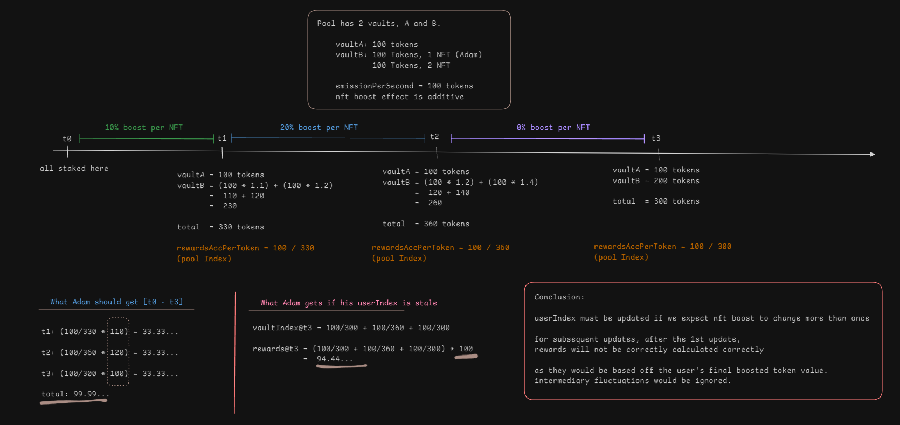
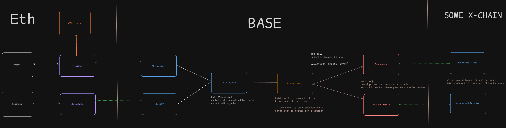

# Staking Pro

Chain: Base

## Staking assets

- $MOCA tokens
- MocaNFTs
- RP [off-chain]

**No limits on staking: MOCA, RP, NFTS; at a pool or contract level**

## Rewards assets

- $MOCA tokens
- Staking Power [off-chain]

## Vault creation

- Only MocaNFT holders can create vaults
- 5 NFTs required to create a single vault
- Creation NFTs are locked to created vault
- Creation NFTs do not count towards rewards calc. or boosting.
- Creator will have to define the fee structure levied upon rewards earned by vault
    -- a single fee structure applies to both MOCA rewards and Staking Power

## Vault characteristics

- Vault have no expiry date unless the vault creator decides to deactivate it.
- All participants in the vault ($MOCA stakers, Moca NFT Stakers, RP committers, Pool Creator) will earn both Staking Power and $MOCA token rewards.
- `No max limit` on RP, $MOCA or NFTs staked.
- All assets (except creation NFTs) can be staked and unstaked at any time; [$MOCA, NFTs, RP].

**Note that RP will not be on-chain**

## Vault deactivation

- Vault can be deactivated by the owner.
- Vault will enter a 7-day cooldown period.

- During cooldown, vault will continue to earn rewards as per normal. However, there can be no inflow of assets.
  - this is to facilitate users early warning notice to move their assets to another pool, avoiding disruption.

- After cooldown, the vault creator can unstake creation NFTs.
  - No further staking is possible.
  - No reactivation is possible.
  - Vault no longer earns rewards.

> for any unstaking action after cooldown, have the fn check if vault's weight has been removed from the pool.
> add check for unstaking and claiming

## Rewards Emitted

1. Staking Power (on-chain emission)
2. Token Rewards (ad-hoc distribution)

All participants ($MOCA stakers, Moca NFT Stakers, RP Stakers, Pool Creator) will earn Staking Power and Tokens.

- Each vault earns rewards proportional to its total allocation points
- Allocation points = boosted value of staked assets
- Global `emissionPerSecond` rate determines Staking Power emission
- Token rewards distributed through separate contract
- Each token type (MOCA, etc.) has dedicated tracking for distribution periods

**Staking Power rewards are simply calculated for record-keeping purposes. It does not actually exist on-chain**

### Rewards emissions calculation

- Token rewards are calculated based on staked MOCA, accounting for NFT boosting effect
- Staking power rewards are calculated based on staked RP, accounting for NFT boosting effect

However, there is a single fee structure that is applied to both token and staking power emissions.
Therefore, RP stakers would also be eligible for token rewards; although their RP contribution does not have weight upon token rewards calculation.

**We will need to define how much staking power is emitted per second, on deployment**

## Rewards boosters

**Applicable to Moca NFTs Only**

- Staking Moca NFTs boosts all reward types
- Creation NFTs do not provide a boost
- Each staked NFT provides a flat 10% boost to base rewards
- Maximum boost is capped at total number of staked NFTs × 10%

### Rewards and Boost calculations

Formula: `finalRewards = baseRewards × (1 + (numberOfStakedNFTs × 0.1))`

Example:
- With 3 staked NFTs: `finalRewards = baseRewards × (1 + (3 × 0.1)) = baseRewards × 1.3`
- With 5 staked NFTs: `finalRewards = baseRewards × (1 + (5 × 0.1)) = baseRewards × 1.5`

Notes:
- Boosts are additive, not multiplicative (they don't compound)
- Unclaimed rewards do not affect boost calculations

## Fees

Vault creators set a single fee structure that applies to both Staking Power and all token rewards:

1. Pool Creator Fee (0-50%)
2. NFT Stakers Fee (split among NFT stakers, excluding creation NFTs)
3. MOCA Stakers Fee (min 50%, split proportionally)
4. RP Stakers Fee (split proportionally)

Rules:
- Total fees must equal 100%
- MOCA stakers must receive ≥50% of all rewards
- Creators can only decrease their fee % to benefit other participants

## Claiming Rewards

- Only tokens claimable on-chain
- Single-click claim for all reward types (NFT staking, creator, token rewards)
- Users can claim all reward types at a token level. I.e. everything that has been emitted to them in tokenA.

## Financing

- Allow partial deposits at any time
- Enable withdrawal of excess deposits
    - Track `totalDeposits` and `TotalRewardsDeposited` for flexible reward management

## Updatable dimensions [!]

### 1. Creation nfts required ✅

Changing this will only affect new pools.
This is acceptable and easy to implement.

### 2. emissionPerSecond ✅

Possible to modify `emissionPerSecond`.
Need to update poolIndex before modifying.

- book the past and close the book.
- the index is representative of rewardsAccPerToken
- doubling the EPS has the same effect as doubling the time delta
- so there will not be any drift or offchain support needed.

Note, as per point 5, each token will have its own `emissionPerSecond` variable for independent tracking.
So will staking power.

> important to ensure that any vaults that are expired have been removed from the pool, before updates are made.

### 3. NFT Staking Boost ✅

+10% Boost per Nft on base Rewards for both Staking Power and Token Rewards.

Modifying the boost per NFT, impacts all vaults in existence.

All `userIndexes` must be synced upon update - requires off-chain support.

Assuming there are vaults still stale across more than 1 update, the rewards calculation will be off at a user Index level.
This is because on the most latest checkpoint, the user's rewards are: `(currentVaultIndex - staleUserIndex) * userAllocPoints`,
where userAllocPoints are based on the most recent NFT boost percentage.


>In the pic above assume that Vault B is really 2 vaults - Adam and the other user occupy different vaults.

### 4. Pool Cooldown Period ✅

Changing this will only affect active pools that are not in cooldown mode.
When cooldown fn is activated, fn checks against the global variable.

### 5. Ad-hoc distribution of tokens ✅

Distribution of token rewards for specific time periods, independent of prior staking history.
For example, we might want to reward stakers for an arbitrary 2 month period; disregarding all previous staking activity.

For forward distribution:

- Each token type has its own reward index tracking
- Rewards calculated using: `(tokenIndex - userIndex) × userAllocationPoints`
- Supports concurrent reward distributions for different tokens
- Index calculation follows same logic as pool index updates
- Each token has `tokenIndex`, and each user has a unique `userIndex` for each token.

**Each token will require a corresponding userAccount**
- think multi-pool, with shared nested vaults

### Token Distribution System

#### Core Components

- Token Reward Vault contract to handle multiple token distributions
- Per-token tracking of distribution periods and indices
- Cross-chain distribution support via LayerZero
- Most edge-ist case:  dist. moca on base and on eth independently

#### Key Features

1. **Independent Distribution Periods**
   - Each token can have its own emission schedule
   - Multiple concurrent distributions possible
   - Rewards calculated as: `rewards = (tokenIndex - userTokenIndex) × userAllocPoints`

2. **Cross-chain Distribution**
   - Users specify destination address for rewards
   - LayerZero integration for cross-chain transfers
   - Destination chain requires token vault

#### Token Distribution Data [WIP]

```solidity
    
    struct TokenData {
        bytes32 tokenAddr;  // LZ: to account for non-evm addr
        uint256 chainId;    // dist. moca on base and on eth independently 

        uint256 startTime;
        uint256 endTime;
        uint256 precision;
        uint256 emissionPerSecond;
        
        uint256 tokenIndex;
        //...
    }

    struct UserData {
        bytes32 tokenAddr;  // LZ: to account for non-evm addr
        
        uint256 stakedTokens;   
        uint256 stakedRealmPoints;   

        // indexes: based on reward tokens
        uint256 userIndex; 
        uint256 userNftIndex;
        
        //.....
    }
    
    // just stick staking power as 0x0?
    mapping (bytes32 token => TokenData token) public tokens;

    // vault base attributes
    mapping(bytes32 vaultId => DataTypes.Vault vault) public vaults;
    // for independent reward tracking              
    mapping (bytes32 token => mapping(bytes32 vaultId => DataTypes.VaultAccounting vaultAccount)) public vaultAccounts;
    // generic userInfo wrt to vault 
    mapping(address user => mapping (bytes32 vaultId => DataTypes.UserInfo userInfo)) public users;
    // Tracks rewards accrued for each user: per token type
    mapping(address user => mapping (bytes32 vaultId => mapping (bytes32 token => DataTypes.UserAccounting userAccount))) public userAccounts;


```

### X-chain Token distribution

- need users to supply `dstAddress` [for non-evm]
- all accounting logics remain the same
- `claim` ends with a x-chain LZ txn to send tokens to destination address
- need a vault on dstChain containing tokens

> consider being able to add functionality to the rewards vault by adding modules.

## OffChain support

1. To remove ended pools from circulation

If we do not remove ended pools from circulation, reward calculation for the remaining active pools will be diluted.

2. When updating NFT boost value

All userIndexes must be updated when updating NFT boost value, to prevent stale rewards calculations.
**create batch fn to update multiple users**

**3. RP support [!]**

1. **Frontend Initiation**
   - User requests to stake RP via frontend
   - Backend validates and generates signed message: [userAddr, amount, vaultId, realmId, expiry, nonce]

2. **Contract Interaction**
   - User calls `stakeRP(vaultId, realmId, amount, expiry, signature)`
   - Contract validates signature against the signer stored on contract, and nonce at a user address level
   - Emits `RPstaked(userAddr, vaultId, realmId, amount)` event

3. **Safety Measures** (Optional)
   - Off-chain monitor validates RP creation; check against an indepedent record.
   - Admin can call `cancelRP(userAddr, vaultId, realmId, amount)` if issues detected
   - On cancellation:
    - record RP cancelled per realmId, per vaultID
    - record user's gas negated

4. **Batching**
   - `stakeRP` accepts arrays for batch operations

Note:
- Users only need to go through the above FE/BE/Signature process to 'onboard' their RP onto the contract.
- Once on the contract, reassigning RP to other vaults will not require signatures; can be purely on-chain.
- However, if the user wishes to 'onboard' additional RP, the above process must be repeated.

Hence, there would be 2 `stakeRp` functions:

- `stakeRP(vaultId, realmId, amount, expiry, signature)`
- `stakeRP(vaultId, amount)`

## Additional Admin functions

1. Batch update vaultIndexes

- for removing ended vaults from circulation

2. Batch update userIndexes

- for supporting updatability of NFTBoost index

# Others / Integrations

## 1. NftLocker and NftRegistry

- Locker to be deployed on mainnet
- Registry to be deployed on Base
- Need to customize and test LZ DVN configurations for ETH<>BASE.
 
## 2. MocaToken

- MocaOFT to be deployed on Base
- Rate limits need to be tested and configured.
- Need to customize and test LZ DVN configurations for ETH<>BASE.

## 3. Staked Nfts and NFTStreaming

NFTLocker needs to support the functional interface of NFTStreaming's check.
Users should be able to stake their NFTs and yet be able to collect MOCA streams.

## 4. Nft locker monitoring

- pause on incorrect withdrawal of nft

## 5. Migration

- On Pro release, simple will be deprecated
- Simple staking contract will be paused, this prevents `stake` from being called.
- Onus is on the user to unstake accordingly.

**Note: Pausing the staking contract does not pause reward calculations for staked amounts. I.e. if a user chooses to unstake months after the contract has been paused, his on-chain rewards calculations will include the paused period as well. Pausing only prevents new inflows.**

# Contracts

- may combine both LZ modules into 1 [pending LZ response]


# KIV

1. StakeBehalf

- Context: Airdrop MOCA to users outside of Staking Pro in some campaign
- Auto-stake the airdrop allocation of MOCA for the users instead of airdropping directly to their wallets
- Users can unstake later on to claim their airdrop if they wish to

However, we will need to airdrop into a specific vault as a user can have multiple vaults under their name.
Need to further think how.

2. Special NFTS

Of the 8888 MocaNfts, 25 of them are 1-1 special types. May want to give special effects, surrounding staking boost or creation requirements.
Pending confirmation.